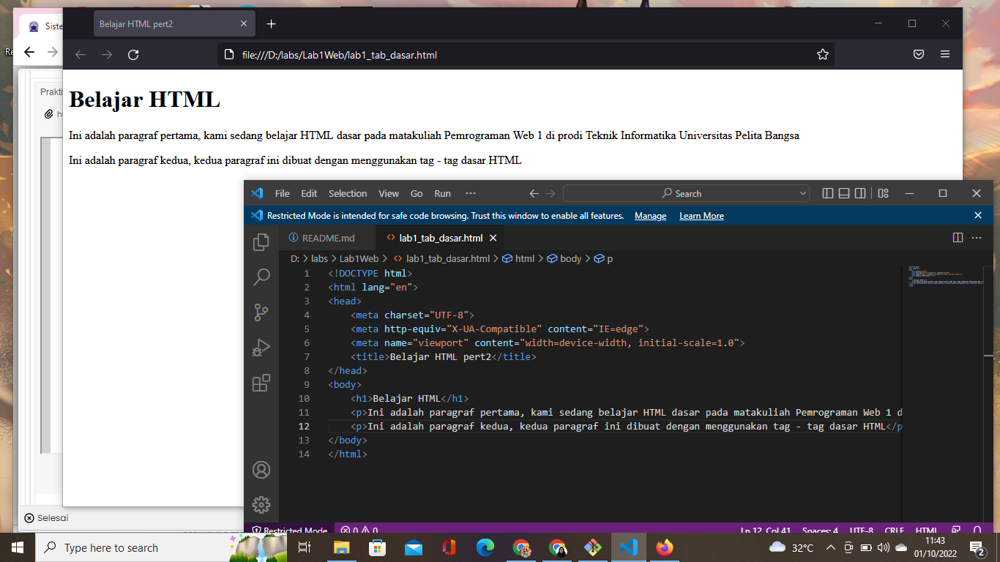

# Lab1Web
## Belajar Tag Dasar HTML

### Membuat Paragraf 
kode tag untuk paragraf adalah `
`
ini adalah tampilannya

#### Mengubah Nama Tab dan Menambahkan Judul
kode tag untuk nama tab menggunakan `<title>` dan cara menambahkan judul menggunakan tag `<h1>` yang merupakan judul pada level 1, begitu pula dengan tag`<h2>`, dan seterusnya sampai tag `<h6>`lalu ini adalah tampilannya.
![img]screenshot/s22.png
