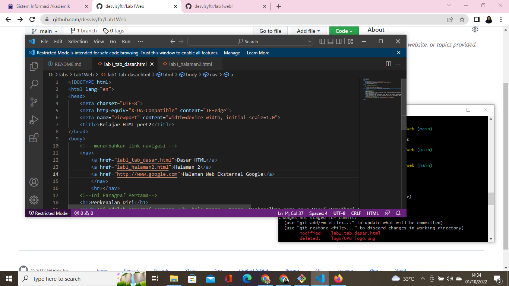

# Lab1Web
## Belajar Tag Dasar HTML

### Membuat Paragraf 
kode tag untuk paragraf adalah `
`
ini adalah tampilannya

### Mengubah Nama Tab dan Menambahkan Judul
kode tag untuk nama tab menggunakan `<title>` dan cara menambahkan judul menggunakan tag `<h1>` yang merupakan judul pada level 1, begitu pula dengan tag`<h2>`, dan seterusnya sampai tag `<h6>`lalu ini adalah tampilannya.

### Mengubah Isi Paragraf dan Memformat Teks
Dalam mengubah isi paragraf dapat dilakukan secara langsung dengan menggunakan `
` dan memformat teks dapat dibuat memakai tag. Beberapa tag nya, yaitu: tag bold `<b>`, tag untuk important text `<strong>`, tag italic `<i>`. berikut ini adalah tampilannya.

### Menambahkan Gambar/Foto
Menambahkan gambar dapat dilakukan dengan cara menyisisipkan gambar pada halaman web, kemudian
simpan file gambar tersebut satu folder dengan file dokumen html. Lalu menggunakan tag `` src, width untuk ukuran gambarnya, dan beginilah tampilannya.

### Menambahkan Hyperlink
Tambahkan hyperlink pada dokumen sebelum heading 1, lalu buat lagi 1 file dengan nama lab1_halaman2 html kemudian isi dokumen tersebut dengan tag html dasar dan dengan isi bebas, lalu gunakan tag `<a>`href untuk menunjuk URL yg dimaksud atau dituju. Begini lah tampilannya.

### Hasil dari yang Saya Pelajari hari ini
![image6]9screenshot/ss6.png)